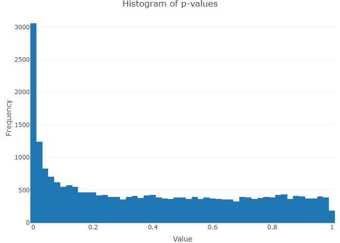
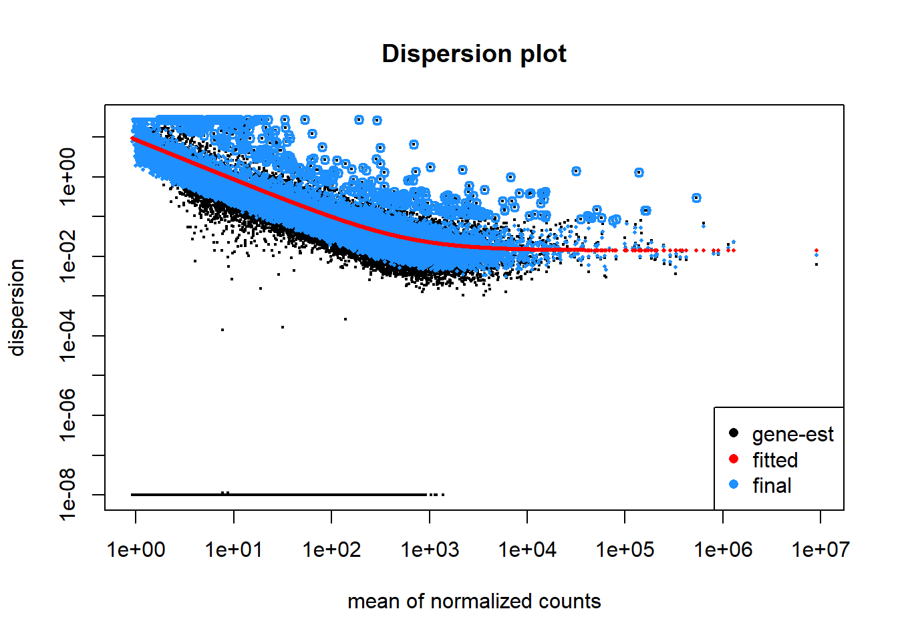

```{r setup, include=FALSE}
knitr::opts_chunk$set(echo = TRUE)
```

# Introduction

Duchenne muscular dystrophy (DMD) is the most common muscular dystrophy beginning in childhood. It is a severe, progressive, X-linked recessive genetic disorder that primarily affects males. It is caused by mutations in the *DMD* gene, which encodes for the protein dystrophin. Mutations in *DMD* can also cause Becker muscular dystrophy (BMD), which is a milder disease with a later onset and a slower progression than DMD. @aartsma-rus2006 On a genomic scale, the *DMD* gene is the largest known gene in humans and spans no less than 2.3 Mb of genomic DNA, making it 90 times larger than the average gene. The coding sequence of 11 kb is dispersed over 79 exons and accounts for only 0.6% of the gene. @ahn1993 This protein dystrophinis essential for maintaining the structural integrity of muscle fibers. @mercuri2019 In the absence of functional dystrophin, muscle cells become damaged and weakened, leading to progressive muscle wasting and weakness and, eventually, to respiratory failure and premature death. Most patients become wheelchair dependent around 10–12 years of age and need assisted ventilation at around 20 years of age. @duan2021 Fortunately, the disease is rare with prevalence less than 10 cases per 100,000 males and casuistic reports in females. @mah2014

The overall pattern of sequentially affected muscles in DMD is highly similar across affected individuals and describes a distinctive pattern of progression. Weakness selectively affects the proximal before the distal limb muscles, and the lower before the upper extremities. Some muscles are affected only in the end stage of the disease, like the cardiac muscle, and some are spared completely, including extraocular muscles (EOM). @birnkrant2018 This indicates that there might be inherent differences in development and composition of specific muscle groups, influencing myofibers susceptibility to damage. This observation inspired the authors of the the original paper to perform their study. @NievesRodriguez2023 In this study, researchers investigated the differences in gene expression between two types of healthy muscle tissue, the vastus lateralis (VL) and the tibialis anterior (TA), to understand mechanism underlying different disease progression in those muscle groups. They used samples from 15 donors to control for differences between individuals and their ages. By analyzing the gene expression differences between VL and TA muscles in healthy adults, the researchers aimed to uncover the protective mechanisms at play when dystrophin, a key protein missing in DMD, is absent. They identified genes that were expressed differently between the two muscles and linked these genes to specific cell types within the muscles using single nuclei analyses. Furthermore, they analyzed transcriptomic differences between TA muscles from healthy donors and from patients suffering from DMD.

Since, given the complexity of Duchenne Muscular Dystrophy, the original article appeared to provide a comprehensive and well-executed exploration of the subject, in my final project I decided to recreate the study and see if anything could be done differently or even improved in some aspects.

# Materials and methods

## Muscle biopsies and sequencing

The analysed data comes from fifteen healthy individuals (age range 18–26 years) with no prior history of muscle disease nor any history of chronic or acute disease. VL sample was obtained from about two-thirds of the muscle length, and the TA from about one-third of the muscle length. Also, eight ambulatory DMD patients with a confirmed nonsense *DMD* mutation were included in the study and their TA muscles were sampled. The samples were then sequenced using standard protocols using Illumina Novaseq 6000 S4. Authors made the raw RNAseq and snRNAseq data generated and analyzed in this study publicly available in the Sequence Read Archive (SRA), from where I downloaded them for further processing (BioProject ID: PRJNA976807).

In the original study, sequencing reads were aligned to GRCh38 (Ensembl 105, Gencode v39) using STAR 2.6.0c. However, I decided to take a different approach. Instead of aligning reads to the genome, the authors of DESeq2 now recommend a faster, alternative pipeline using quantification data because of advantages such as increased accuracy of gene-level estimation, improved robustness of statistical performance, and enhanced interpretability of results. @michaellove2017. Also, in independent studies the quantification methods proved to outperform traditional alignment-based workflow and are also recommended by researchers uninvolved in the DESeq project. @zheng2019 Therefore, I used Salmon (version 1.10.3) @patro2017 to obtain counts, with latest human transcriptome annotation from GENCODE v46 @frankish2022 as reference index.

## Differential expression analysis

Transcript abundance files were imported and gene-level count matrices created using tximport package. @soneson2015 Raw counts were processed, and genes with mean counts of less than 1 across all samples were discarded. The R package DESeq2 (version 1.44.0) @love2014 was used to perform differential gene expression analysis. The covariates included in the healthy VL versus TA analysis design were sex and batch. The original article did not account for sex in the design of this analysis, which I found not entirely understandable, since it can heavily influence gene expression profile. The covariates included in the DMD versus Healthy analysis design were again batch, and sex. Originally age was also included, but it is more of a methodological obstacle. DMD patients were aged 3 to 7 years old and dividing participants by age and healthy status are virtually equivalent, therefore including age could potentially lead to loss of variation. Unfortunately, the original study did not include age paired healthy controls, nor did any other study available online. Multiple testing adjustment was done within DESeq2 using Benjamini–Hochberg for a false discovery rate (FDR) of less than 0.05.

Functional enrichment analysis of differentially expressed genes was performed for all differentially expressed genes (independent of their direction of highest expression) using clusterProfiler. @wu2021 Genes were tested against GO Biological Process and GO Cellular Component. @thegene2023

Pathway enrichment analysis was performed using gage @luo2009 testing for pathways from KEGG database.

## Single cell sequencing

Single nuclei were isolated from a subset of 3 paired male healthy VL and TA muscles and sequenced using the 10X Genomics platform. 10X Chromium Single cell libraries were prepared and sequenced on Illumina Novaseq 6000 S2. Single nuclei RNA sequencing (snRNAseq) reads were aligned to GRCh38 (Ensembl 105, Gencode v39) using Cell Ranger (10X Genomics). Initial cell clustering was performed using k-means within Cell Ranger (10X Genomics). Nuclear doublets were identified using DoubletFinder. Those are all steps done in the original paper, and the data provided by authors, and therefore used in my project, was provided as a Seurat object. Further single cell analysis was done using Seurat. @hao2021

Bulk RNAseq read counts for single cell data were obtained using Seurat's AggregateExpression. Estimated cell proportions for each sample were calculated with granulator, @granulator as CIBERSORTx, considered a reference tool and used in the original study is not freely available, using average gene expression across eight cell types.

# Results

## Transcriptomic differences between VL and TA

The main driving force for the study was the difference in progression of muscular dystrophy between different muscle groups. Therefore, the first result is characterization of expression profiles for VL and TA. Firstly, Principal component analysis of all expressed genes reveals, that the samples cluster predominantly by sex of the participant and then by muscle type in subclusters. Accounting for the first two PCs, there is more similarity between same muscle group samples of unrelated individuals than it is between different samples from the same individual. However, the clustering revealed that some individuals were more likely to cluster together, a phenomenon not observed in the original analysis. This could not be explained by different choice of covariates as it was present regardless of including RIN, age and sex in the design. Likely it is a result of quantification method.

A total of 2,790 genes were classified as differentially expressed, equaling to 11.2%. It is a number comparable to originally observed (3,410, 15.2%). The most statistically significant differentially expressed gene was the transcription factor *ZNF385A,* a zinc finger protein, which is known for potential impact to suppress apoptosis. Thus, ZNF385A may protect the TA via modulation of p53 signaling towards an anti-apoptotic state. @das2007 Other genes included *BNC2, CCR3, ANKS1B* and *XCR1*, encoding zinc finger motifs and chemokine receptors. Reassuringly, *ZNF385A* was also found to be the most significant by Nieves-Rodriguez.

.png){width="600"}

Gene Ontology analysis revealed a substantial amount of enriched biological processes (881), the most significant being cytoplasmic translation, muscle system process, muscle contraction and muscle cell differentiation and development, a finding consistent with Nieves-Rodriguez, however I found no enrichment in programmed cell death processes, even after summarizing with ReviGO, as did Nieves-Rodriguez. Among Cellular Components, 174 were found to be enriched in TA muscle, predominantly cytosolic ribosome, focal adhesion and cell-substrate junction. A summary of top enriched terms with top genes are in the table:

+-----------------------------------+-----------+-----------+-----------------------------------------------------+
| Description                       | p.adjust  | qvalue    | geneID                                              |
+===================================+===========+===========+=====================================================+
| **Biological processes**          |           |           |                                                     |
+-----------------------------------+-----------+-----------+-----------------------------------------------------+
| cytoplasmic translation           | 2.08E-44  | 1.71E-44  | ^[RPS20/YBX3/RPL18/YBX1/RPL31/RPS5/]{.smallcaps}^   |
|                                   |           |           |                                                     |
|                                   |           |           | ^[EIF3I/RPL6/RPLP0/EIF3L/RPL3/EIF3E]{.smallcaps}^   |
+-----------------------------------+-----------+-----------+-----------------------------------------------------+
| muscle system process             | 2.31E-25  | 1.89E-25  | ^[CD38/TBXA2R/ATP1A2/TNFRSF1B/]{.smallcaps}^        |
|                                   |           |           |                                                     |
|                                   |           |           | ^[MYOC/MYOM2/CYBA/KCNQ1]{.smallcaps}^               |
+-----------------------------------+-----------+-----------+-----------------------------------------------------+
| muscle contraction                | 7.59E-24  | 6.21E-24  | ^[CD38/TBXA2R/ATP1A2/MYOM2/KCNQ1/]{.smallcaps}^     |
|                                   |           |           |                                                     |
|                                   |           |           | ^[MYLK/CACNB1/KCNN2/CACNA1S]{.smallcaps}^           |
+-----------------------------------+-----------+-----------+-----------------------------------------------------+
| muscle cell development           | 3.00E-19  | 2.46E-19  | ^[KDM1A/MYOM2/ACTN1/CACNA1S/]{.smallcaps}^          |
|                                   |           |           |                                                     |
|                                   |           |           | ^[ZMPSTE24/TBX5/MYH7/CAPN3/NFATC4]{.smallcaps}^     |
+-----------------------------------+-----------+-----------+-----------------------------------------------------+
| muscle cell differentiation       | 1.09E-18  | 8.90E-19  | ^[KDM1A/IFRD1/CD9/EHD2/MYOM2/RORA/]{.smallcaps}^    |
|                                   |           |           |                                                     |
|                                   |           |           | ^[ACTN1/NFATC3/IL4R/CACNA1S]{.smallcaps}^           |
+-----------------------------------+-----------+-----------+-----------------------------------------------------+
| muscle tissue development         | 9.97E-14  | 8.16E-14  | ^[IFRD1/MYOM2/ELN/FOXC1/YBX3/MYLK/]{.smallcaps}^    |
|                                   |           |           |                                                     |
|                                   |           |           | ^[PITX1/CACNA1S/ZMPSTE24/TBX5]{.smallcaps}^         |
+-----------------------------------+-----------+-----------+-----------------------------------------------------+
| **Cellular components**           |           |           |                                                     |
+-----------------------------------+-----------+-----------+-----------------------------------------------------+
| cytosolic ribosome                | 2.69E-47  | 2.18E-47  | ^[RPS20/RPL18/RPL31/RPS5/RPL6/RPLP0/]{.smallcaps}^  |
|                                   |           |           |                                                     |
|                                   |           |           | ^[RPL3/GSPT1/RPS16/RPS19/RPL18A]{.smallcaps}^       |
+-----------------------------------+-----------+-----------+-----------------------------------------------------+
| focal adhesion                    | 3.98E-38  | 3.23E-38  | ^[LASP1/CD9/PLAUR/VIM/CD44/TNC/SYNE2/]{.smallcaps}^ |
|                                   |           |           |                                                     |
|                                   |           |           | ^[NCKAP1/RPL18/CNN2/NHERF2]{.smallcaps}^            |
+-----------------------------------+-----------+-----------+-----------------------------------------------------+
| ribosomal subunit                 | 5.77E-32  | 4.67E-32  | ^[RPS20/MRPS24/RPL18/RPL31/RPS5/]{.smallcaps}^      |
|                                   |           |           |                                                     |
|                                   |           |           | ^[RPL6/RPLP0/RPL3/RPS16/RPS19]{.smallcaps}^         |
+-----------------------------------+-----------+-----------+-----------------------------------------------------+
| cytosolic large ribosomal subunit | 3.96E-31  | 3.21E-31  | ^[RPL18/RPL31/RPL6/RPLP0/RPL3/RPL18A]{.smallcaps}^  |
|                                   |           |           |                                                     |
|                                   |           |           | ^[/RPL19/RPL34/RPL24/RPL22/RPL21]{.smallcaps}^      |
+-----------------------------------+-----------+-----------+-----------------------------------------------------+
| contractile fiber                 | 3.10E-27  | 2.51E-27  | ^[MYOM2/SYNE2/ACTN1/FERMT2/KCNN2/]{.smallcaps}^     |
|                                   |           |           |                                                     |
|                                   |           |           | ^[CACNA1S/MMP2/MYH7/CAPN3]{.smallcaps}^             |
+-----------------------------------+-----------+-----------+-----------------------------------------------------+

.png){width="600"}

## Cell type differences

Fiber type composition varies between skeletal muscles: VL has a larger portion of fast myofibers than TA. The difference in disease progression was partly attributed to different content of fast muscle fibers, which are more susceptible to damage in the disease course than slow fibers. This would be incosisten with sparing of EOM which are composed mostly of fast myofibers. To asses the potential relation, the authors performed single-nucleus sequencing on the muscle samples from 3 healthy individuals. After clustering, eight major cell populations could be identified, and their markers found with Seurat's FindAllMarkers. In agreement with previous knowledge and the original paper's findings, the fast myofibers content was different between TA and VL and was higher in VL. In TA there was a greater proportion of smooth muscle cells, suggesting a higher density of vascularity.

.png)

There were differentially expressed 2446 genes that could be matched with genes in the single cell subset. After calculating, in which cell types those genes are most highly expressed, only 24.12% of them were most highly expressed in myofibers (356 in fast fibers and 234 in slow-fibers). An interesting observation from the source article was that despite satellite cells, endothelial, smooth muscle and fibroblasts account for 6.60%, 7.01%, 0.69% and 3.17%, the percentage of differentially expressed genes with highest expression in these cell types were 15.71%, 14.96%, 10.87% and 8.20%, respectively. I was not able to replicate the finding. Deconvoluting the bulk RNA data with granulator, the content of those cell types was estimated to be 6.31%, 12.7%, 13.1% and 7.9%, respectively, and assigning differentially expressed genes to cell types in which they were mostly expressed yielded roughly the same proportion (17.2, 14.3, 11.1 and 7.9%) with an important discordance in satellite cells. This is consistent with the finding of enrichment in muscle cells differentiation and development processes, a main function of satelite cells as well as reaction to muscle damage. @siegel2011

## Transcriptomic differences in DMD affected muscles

To further understand the transcriptomic differences in disease progression, analysis of differentially expressed genes was performed between TA muscles from healthy controls and DMD patients. A total of 21 samples was analysed using DESeq2, discovering 8107 differentially expressed genes, or 27.5% (out of 29,436). In the reference article, only 868 (out of 17,183, 5.1%) were found to be differentially expressed. It was the most surprising result, given the dramatic effect *DMD* mutations have on muscle, but also unbalance of the groups in terms of age and sex, which are known factors influencing expression. Of those, 1473 were also differentially expressed in TA versus VL. Among them 202 were up regulated in DMD and down regulated in TA, and 74 were down regulated in DMD and up regulated in TA.

To asses the cause of this difference, I excluded female samples from the analysis, but the results did not change significantly (7230 differentially expressed out of 28,018). However, including age in the analysis resulted in only 767 DE genes. While it explains the variation in findings, this seems not to be a good approach. Due to ethical concerns, age matching controls could not be obtained. Treating age as a continuous variable, given that the groups are 2-8 and 19-26 years old respectively leads to underestimation of DE genes. Categorization of the variable is impossible as it leads to rank deficient experiment matrix. Thus, not including age seemed like the optimal choice, leading to results more consistent with previous findings (for example @vanpelt2020).

Genes that were the most under expressed in DMD muscles were *RPL23AP63*, or ribosomal protein L23a with -18 log2FoldChange, *GTF2IP1*, or general transcription factor IIi (-14 log2FoldCHange) and *USP32P1,* encoding ubiquitin specific peptidase. Notably, many of the most under expressed genes are novel transcripts yet to be characterized, potentially leading to better understanding of cell-level defects in DMD. Highest overexpression was observed in *ZNF271P, C22orf46P, NPY6R.* Notably, nearly 10 fold change was observed in *MAPK8IP1P2,* which encodes a mitogen-activated protein kinase. MAPK family is crucial in regulating cell cycle, proliferation and programmed death. @pearson2001 This can support recent hypotheses of more important role of apoptosis over necrosis, which was thought to be dominant in DMD. @bencze2022

.png)

Enrichment analysis revealed 1979 disregulated processes, of which 537 were also enriched in TA versus VL. The most significant differences were in ncRNA processing, protein catabolism and macroautophagy, which were also present in TA-VL. There were 379 enriched terms from GO Cellular Components. Similar to TA-VL, the most significant were cell-substrate junction, focal adhesion but also mitochondrial matrix.

# Discussion

The main goal of this project was a modified replication of the study by Nieves-Rodriguez. Given the detailed nature of the original study, I anticipated broadly similar results with minor methodological differences. However, my findings diverged in several key aspects.

Initially, I modified the read quantification step. While the original authors aligned reads to the GENCODE v39 human reference genome, they did not explicitly state their method for obtaining feature counts. I opted for Salmon quantification with the GENCODE v46 transcriptome, which includes a broader range of features, including non-coding RNAs and other features. This resulted in a larger pool of analyzed genes (approximately 60,000), leading to a higher proportion of matched genes but also a greater number of sparsely expressed genes that were subsequently discarded. Despite this methodological difference, our core results at this stage aligned reasonably well with the original study.

The single-cell analysis component heavily relied on the original findings. Due to the lack of access to proprietary 10X Genomics tools, I could not repeat the analysis from raw counts but instead began with the provided Seurat object. However, our estimation of cell proportions yielded different results. While the original study reported some cell types with excessively high gene expression, I did not observe this phenomenon. This discrepancy could be attributed to the use of different software (granulator vs. CIBERSORTx) or the choice of marker genes (Seurat's FindMarkers vs. manual curation).

The most significant discrepancies arose in the analysis of differentially expressed genes (DEGs). Due to methodological differences, my initial analysis included a larger background of approximately 30,000 genes. Results comparing healthy muscle groups were broadly consistent. However, when comparing healthy and affected muscles, the results diverged significantly. The surprisingly low number of DEGs in DMD samples reported by Nieves-Rodriguez contrasts with previous findings in mice, which demonstrated profoundly altered expression profiles. @vanpelt2020 This discrepancy is further compounded by the unbalanced experimental design, with age and sex as potential confounding factors. Unfortunately, the lack of access to the original authors' code or intermediate results precludes a definitive explanation for this divergence.

While the authors briefly acknowledged the age discrepancy among participants, they neither elaborated on the rationale behind their approach nor explicitly stated the extent to which handling of this factor in statistical analysis influenced the results. This omission raises concerns about the interpretation of the results, as the observed shift in outcomes may be attributable to unwanted loss of variation in the course of statistical analysis.

In conclusion, while my project largely reproduces the findings of Nieves-Rodriguez regarding gene expression differences between healthy muscle groups, significant discrepancies emerged in the analysis of DMD-affected muscles. These discrepancies underscore the importance of thoroughly explaining the rationale behind the analysis design, attention to detail understanding the methodology before interpreting the results.

Transparency in research, through the provision of source code and intermediate materials, facilitates the interpretation and comparison of results, enhancing reproducibility. It's important to acknowledge that even with identical datasets, variations in results can arise due to differences in software tools and methodologies. Therefore, while comprehensive reporting of all steps and software used is essential, researchers must also recognize that the reliability of their findings is inherently limited by the reliability of the tools employed.

# Supplementary figures

## QC of TA vs. VL

{width="400"}

{width="400"}

## QC DMD vs. control

.png){width="400"}

.png){width="400"}

## Cell-death realted pathways disregulated in DMD (TGF-$\beta$ and p53), calcium signaling pathway

{width="300"}

{width="300"}

{width="300"}
